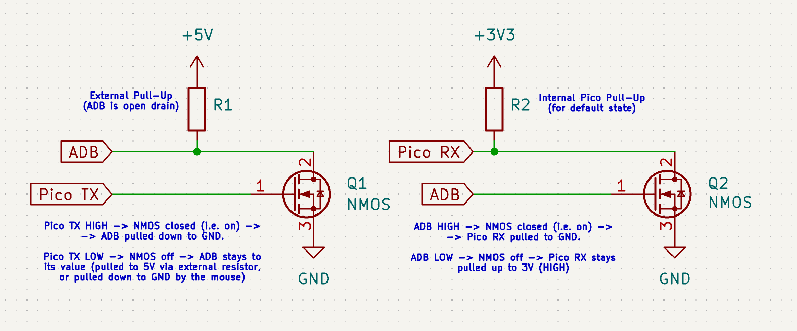

# Pico Apple Desktop Bus Mouse USB interface
Pico PIO-based adapter for using older Macintosh Mouses via USB. Specifically, the Apple Desktop Bus Mouse, G5431.

This simple one-day project uses PIO to communicate with the bus via the [Apple Desktop Bus (ADB) protocol](https://en.wikipedia.org/wiki/Apple_Desktop_Bus) and TinyUSB for the Pico to act as a USB Mouse. In simple terms, the Pico acts as an adapter.

## Circuit
I am using 2 NMOS transistors, one for reading the ADB line, and þe other one for pulling the line. Due to how the circuit is wired, those transistors will invert the logic signal, so a HIGH voltage level will be read as LOW, or the other way around - and same for written values.



I've used those MOSFETs since I had them handy. They allow for easy logic level conversion. Plus, having 2 separate pins for RX and TX allows me to avoid switching the pin direction, which takes additional PIO instructions. Thanks to this and a few other decisions, I've been able to fit the program on one single PIO state machine, in a 32-instruction program (which is exactly the maximum number of allowed instructions).

## ADB commands
The command sent to read the registers is TALK Register 0. TL;DR there are 4 registers, register 4 contains device information, while register 0 contains the actual mouse data, encoded like this:

```
  15 14     8  7  6      0
+---+--------+---+--------+
|Btn| Y-axis | 1 | X-axis |
+---+--------+---+--------+
```

The Y-ais and X-axis numbers are 7-bit two's complement numbers, representive relative movements. Btn state is active-low: `0 = pressed`, `1 = released`.

## PIO program
- 1 single program on a single PIO State Machine
- Composed of 32 instructions - this is the maximum allowed for one state machine
- This was achieved by:
    - Allowing max 4 bytes to be read from devices (the official ADB spec allows 2-8 DATA bytes; our mouse uses 2).
    - Using non-optional side set (allows larger delay values)
    - Minimizing post-processing, i.e. response bits are kept inverted. The main core must invert the data itself.
    - Crafting an easily parseable FIFO input format; see below.

- PIO FIFO input:
   - 8 COMMAND bits to be send
   - 8 bits for count, i.e. indicating how many DATA bits we're set to receive (if any).
       note: the value sent to pio should be 8*DESIRED_BYTE_COUNT-1.
   - remaining 16 bits are kept to 0

## License
Licensed Apache 2.0 - Copyright (c) 2026 Cristian Dinca.

Includes code from [swiftlang/swift-embedded-examples](github.com/swiftlang/swift-embedded-examples) - CMake config - licensed Apache License v2.0 with Runtime Library Exception. Modifications were made to adapt this to our codebase. Copyright (c) 2023 Apple Inc. and the Swift project authors.

Includes code from TinyUSB (MIT Licensed) - Copyright (c) 2019 Ha Thach (tinyusb.org).

## Resources

- https://archive.org/details/apple-guide-macintosh-family-hardware/Apple_Guide_to_the_Macintosh_Family_Hardware_2e?view=theater#page/n325/mode/2up
- https://developer.apple.com/library/archive/technotes/hw/hw_01.html#Section2
- https://ww1.microchip.com/downloads/en/AppNotes/00591b.pdf
